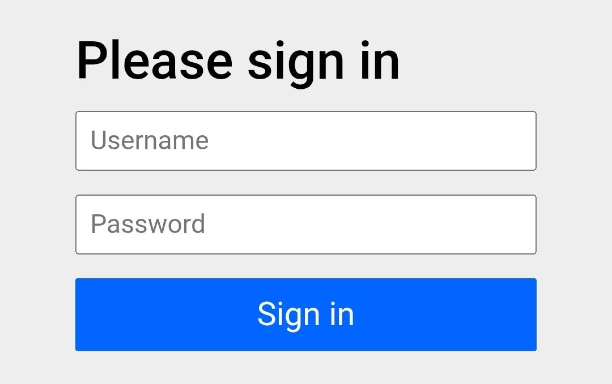
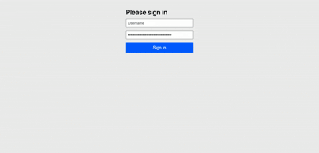
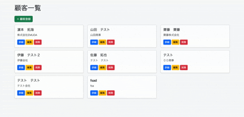
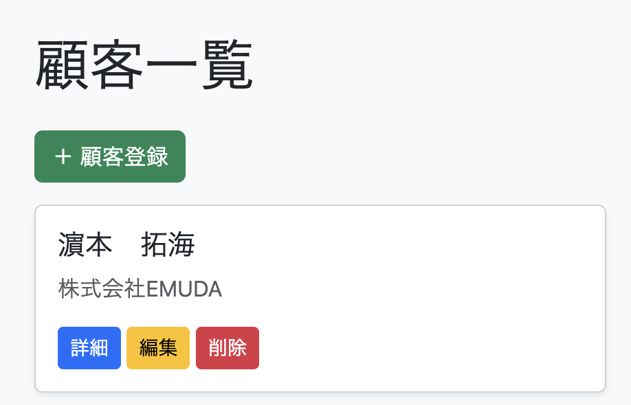
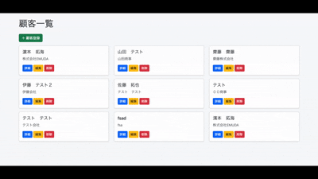
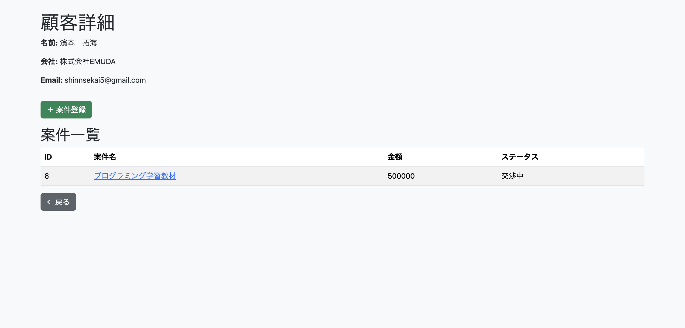
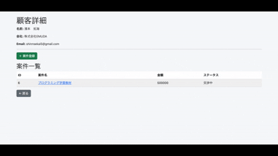

# Sales Management App（営業管理アプリ）

## 📌 概要
顧客・案件（商談）・商談メモを一元管理できる営業支援アプリです。  
顧客ごとの案件進捗や履歴を可視化し、営業活動の効率化を目的として開発しました。

## 👤 想定ユーザー
- 顧客情報や案件管理を効率化したい営業担当者
- Excelやメモでの管理に限界を感じている人

## 🗺️ アプリURL(Railway)
https://sales-management-system-production-96ec.up.railway.app/login  
Username user  
Password ad63c97f-ec91-4f76-a873-7df37f9cb794



Qiita に詳細を執筆しております。   
[→JavaとSpringBootを使って営業管理アプリを開発した](https://qiita.com/shinnsekai5/items/0ca0cdcd98a7f64a7a7d)

## 🚀 主な機能

| 機能 | 内容 |
|------|------|
| 顧客管理 | 登録 / 一覧 / 詳細 / 編集 / 削除 |
| 案件管理 | 顧客ごとに案件を紐付けて管理 |
| ステータス管理 | 提案中 / 交渉中 / 受注 / 失注 |
| メモ機能 | 商談メモの登録・履歴管理 |

## ✏️ ER図


---
## 💻 使用技術
- Java 21
- Spring Boot 3.5.11
- Spring Data JPA
- Spring Security
- Lombok
- Thymeleaf
- Bootstrap
- H2 Database
- Render/Railway

## ☑️ 動作確認
### 1.ログイン
- UsernameとPasswordを入力してログインします。  
  

### 2.顧客一覧
- 左上の「顧客登録」より顧客情報を登録します。
- 「名前」「email」「会社名」の登録が可能です。  
  

- 顧客情報を登録後、一覧に反映されるので「詳細」「編集」「削除」が選択可能になります。（CRUD処理）


### 3.顧客詳細登録
- 顧客一覧の「詳細」から「案件登録」にて顧客の案件登録ができます。
- 「案件名」「金額」「ステータス（提案中、交渉中、受注、失注）」の登録が可能です。
  

- 案件登録を登録後、顧客一覧に表示されます。
  

### 4.商談メモ登録
- 案件名の中に「メモ追加」ボタンがあるのでそちらから詳細を登録可能です。
- 登録したら商談メモ一覧に表示されます。  
  

## 👓 工夫した点
- MVC構成を意識し、責務を明確に分離
- 顧客 → 案件 → メモの1対Nのリレーション設計を実装
- CRUD機能を一通り実装し、実務に近い構成を意識
- Bootstrapでシンプルかつ視認性の高いUIを設計

## 💧 苦労した点
- Spring Security導入時の認証
- Renderデプロイ時のバグ

## 🔥 今後の改善
- ログイン機能の実装
- 案件詳細・案件メモにCRUD処理の追加
- 複数人での利用をする為の実装
- バリデーション強化
- UI/UX改善
- AWSデプロイ
- 参照整合性制約違反の問題解決

## 📲 その他
- 携帯にて動作確認済み

## 💿 ローカル起動方法
```bash
git clone https://github.com/your-username/sales-management.git
cd sales-management
./gradlew bootRun

